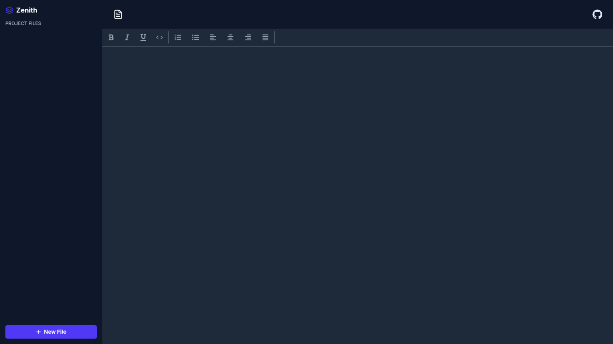

# Zenith Editor

Zenith Editor is a visually appealing, modern, and minimalist text editor interface designed for focus and clarity.

## Features

*   **Distraction-Free Interface:** A deep dark mode design (`bg-dark`) with high-contrast typography designed to reduce eye strain during long writing sessions.
*   **Modern UI Architecture:**
    *   **Sidebar:** Project file navigation and management interface.
    *   **Header:** Document title editing and sharing controls.
    *   **Toolbar:** A comprehensive set of formatting tools (Bold, Italic, Headings, Lists, etc.).
*   **Responsive Design:** The layout adapts gracefully, hiding the sidebar on smaller screens (`md` breakpoint).
*   **Typography:** Optimized prose styling using Tailwind's typography patterns.

## Tech Stack

*   **Frontend Framework:** React 19
*   **Language:** TypeScript
*   **Styling:** Tailwind CSS 
*   **Icons:** React Icons

## License

This project is open source and available under the MIT License.
